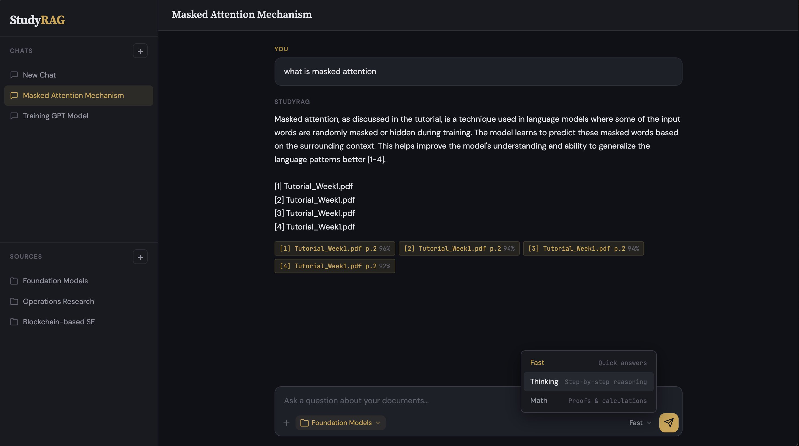
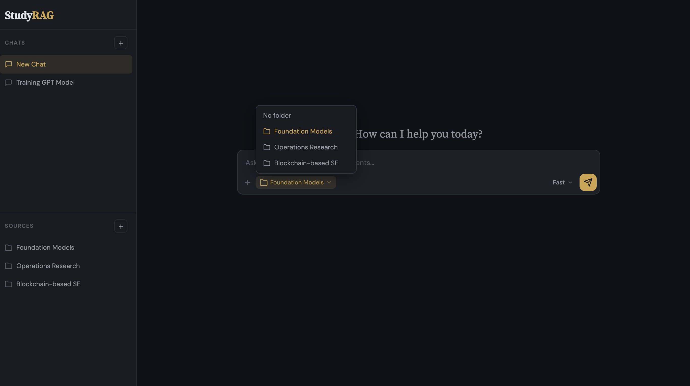
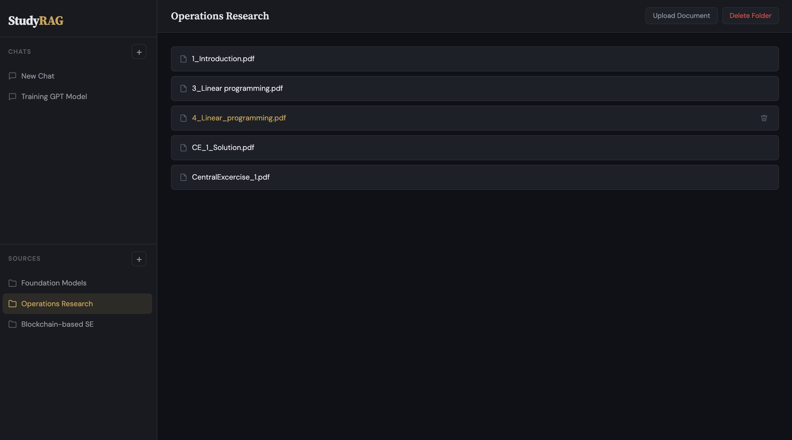

# StudyRAG

A local RAG system for academic purposes that answers questions only by using the chosen material and cites to the exact location from which the answer is derived. 







---

## How it works

<p align="center">
  
</p>

---

## Design choices

**Softened cite-or-decline.** The system doesn't refuse to answer just because the sources don't spell everything out. If a term like "masked attention" appears in the slides but isn't explained there, the model explains it using its own knowledge, marks that part as general knowledge, and still cites where the term was found. It only declines when the question has genuinely no connection to any source.

**Fully local.** Ollama runs the LLM on Apple Silicon Metal, embeddings run via sentence-transformers on CPU, and ChromaDB stores vectors on disk. No API keys, no internet required. Your academic materials never leave your machine.

**Metadata injection.** Each chunk is prefixed with its filename and page number before embedding: `[Tutorial_Week1.pdf | Slide 12] The scaling hypothesis...`. This means you can ask "explain slide 12 in the tutorial" and the vector search will actually find it, as the filename and page number are part of the searchable text and not hidden in metadata fields.

**Folder-scoped sources.** There is no global document store. Each source folder ("Linear Algebra", "Foundation Models") gets its own ChromaDB collection. When you ask a question, only the selected folder is searched. This prevents cross-contamination: a question about eigenvalues won't pull in irrelevant chunks from the biology slides.

**Cross-encoder reranker.** The initial vector search casts a wide net with a loose threshold. Then a cross-encoder model re-scores each retrieved chunk by looking at the query and chunk together (not as independent embeddings). This catches relevant chunks that the embedding model underscored and filters out false positives.

**One repair attempt before declining.** Small models frequently produce a correct, well-grounded answer and omit the citation markers. The pipeline distinguishes the two (reason="uncited" vs "model_declined") and makes one corrective call asking for the same answer with markers added, forbidding any rewrite. If that fails, it declines.

**Reasoning traces are excluded from the answer.** The thinking mode runs deepseek-r1:8b, which emits its chain of thought inside <think> tags before the final answer. This creates a problem for the citation gate: a [2] written while the model was still deliberating would satisfy the requirement without the student ever seeing a cited claim. citation.py therefore strips reasoning blocks before parsing, so only markers in the delivered answer count.

**Domain-aware prompting.** The folder name is injected into the prompt as the academic subject context. This tells the LLM to interpret terms in the right field, i.e. "attention" means transformer self-attention in a Foundation Models course, not the psychological concept.

**LLM-generated chat names.** When you send your first message, the system sends the question to the LLM with a short prompt asking for a 2-5 word topic title. The chat is renamed from "New Chat" to something like "Masked Attention Mechanism" or "Gradient Descent Convergence" automatically.


---

## Setup

**Prerequisites**

- Python 3.11+
- [Ollama](https://ollama.com) installed
- ~10 GB free disk space (for models and vector store)

**1. Clone and install**

```bash
git clone https://github.com/YOUR_USERNAME/studyrag.git
cd studyrag
python -m venv venv
source venv/bin/activate
pip install -r requirements.txt
```

**2. Pull the models**

```bash
ollama pull mistral:7b           # Fast mode
ollama pull deepseek-r1:8b       # Thinking mode
ollama pull phi4-mini             # Math mode
```

**3. Configure**

```bash
cp .env.example .env
# Edit .env if you want to change models, thresholds, or ports
```

**4. Start Ollama and launch**

```bash
# Terminal 1
ollama serve

# Terminal 2
source venv/bin/activate
python -m api.main
```

Open [http://localhost:8000](http://localhost:8000) in your browser.

**5. Add your documents**

Create a source folder in the sidebar (e.g., "Linear Algebra"), click on it, and upload your PDFs, slides, or text files. They'll be chunked, embedded, and stored. Then create a new chat, select the folder from the toolbar, and start asking questions.

You can also bulk-ingest from the terminal:

```bash
python -m ingestion.store --folder "Linear Algebra" --source ./documents/linalg/
```

---

## Tech stack

| Layer | Tool | Role |
|---|---|---|
| LLM | Ollama | Runs language models locally with Metal acceleration |
| Models | Mistral 7B, DeepSeek-R1 8B, Phi-4 Mini | Fast answers, deep reasoning, and math respectively |
| Embeddings | sentence-transformers (all-MiniLM-L6-v2) | Converts text chunks and queries into vectors |
| Reranker | cross-encoder/ms-marco-MiniLM-L-6-v2 | Re-scores retrieved chunks for better precision |
| Vector store | ChromaDB | Stores and searches embeddings, one collection per folder |
| Doc parsing | PyMuPDF, python-pptx | Extracts text from PDFs and PowerPoint slides |
| Backend | FastAPI | Serves the API and static frontend |
| Frontend | Vanilla HTML / CSS / JS | Dark-themed chat interface, no build step |

© 2026 Cagan Akin. All rights reserved. This repository is published only for review.